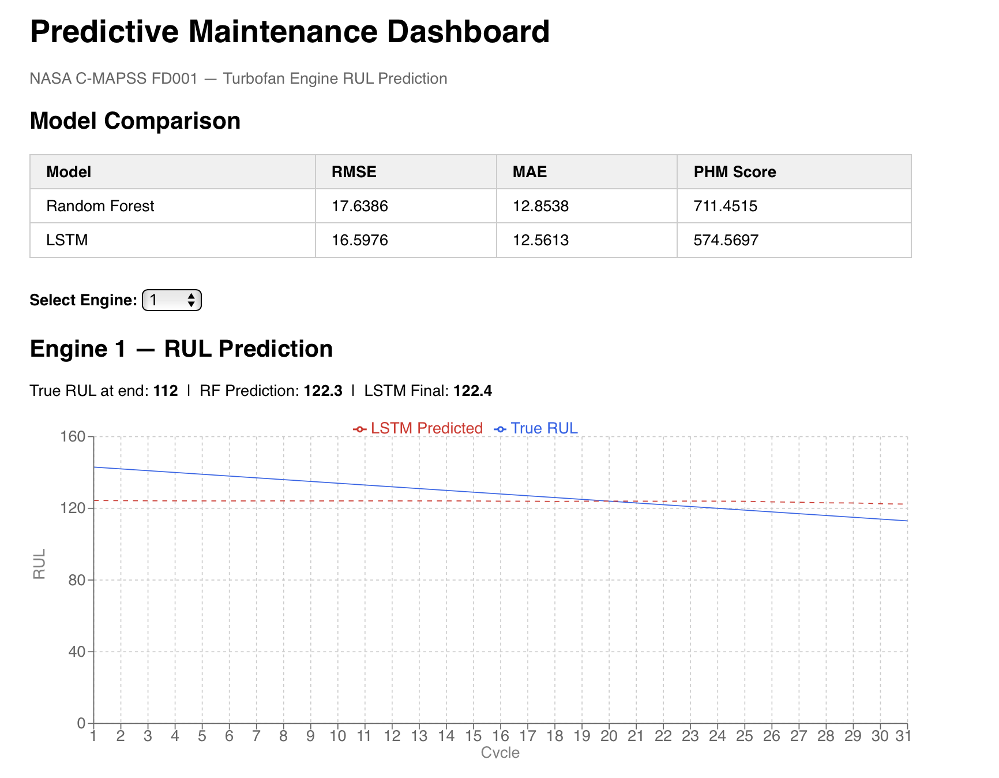
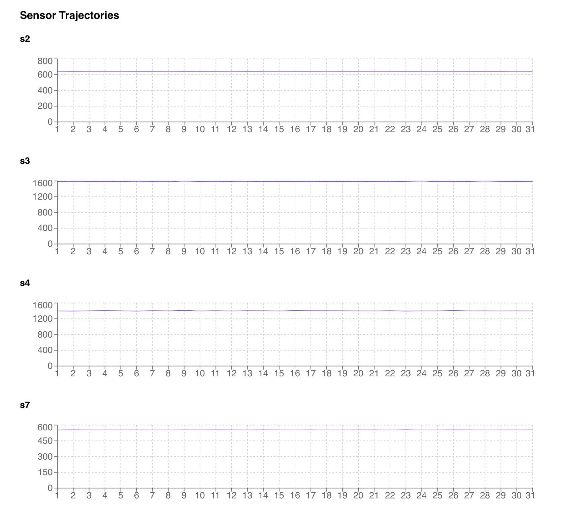

# Predictive Maintenance — NASA C-MAPSS Turbofan Engine RUL Prediction

An end-to-end machine learning system that predicts the Remaining Useful Life (RUL) of industrial turbofan engines from multivariate sensor time-series data. Built on the NASA C-MAPSS dataset.

## Results (FD001)

| Model | RMSE | MAE | PHM Score |
|---|---|---|---|
| Random Forest (baseline) | 17.64 | 12.85 | 711.45 |
| LSTM (PyTorch) | 16.60 | 12.56 | 574.57 |

Published benchmarks for FD001: Random Forest ~18-22, solid LSTM ~13-16, top models ~11-13.

LSTM beats the Random Forest baseline on all three metrics. PHM score improvement (711 → 574) is the most industrially meaningful result — the asymmetric penalty heavily weights late predictions (missed failures), so a 19% reduction in PHM score represents a meaningful reduction in predicted missed-failure risk.

**Prognostic horizon:** LSTM produces reliable predictions (within ±20 cycles) for 79/100 test engines, with a mean warning horizon of 70.7 cycles before failure.

**Statistical comparison:** Paired t-test across 100 test engines yields p=0.777. The RMSE gap is real but not statistically significant at this sample size — an honest result reported transparently.

---

## Project Structure
## Methodology

### Dataset
NASA C-MAPSS FD001: 100 train / 100 test turbofan engines, single operating condition, single fault mode. Each engine has 21 sensor readings per cycle recorded until failure. Test set contains partial trajectories; ground truth RUL provided separately.

### RUL Computation and Clipping
Training RUL computed as `max_cycle - current_cycle` per engine. Clipped at 125 cycles — degradation is only sensor-observable in the final ~125 cycles, so early healthy readings are treated as equally "not yet degrading." Standard practice in C-MAPSS literature.

### Feature Engineering
- **Variance filtering:** 7 of 21 sensors dropped (s1, s5, s6, s10, s16, s18, s19) based on near-zero variance across training data. Identified from training set only to avoid data leakage.
- **Rolling statistics:** Mean, std, min, max over a 30-cycle window per engine. Captures degradation trends rather than snapshots.
- **Trend slopes:** Linear regression coefficient over rolling window per sensor. Distinguishes a stable sensor from one trending toward failure.
- **Normalization:** StandardScaler fit on training data only, applied to test.
- Total: 84 engineered features from 14 useful sensors.

### Models

**Random Forest:** Trained on 84 engineered features. 100 estimators, no max depth, min samples leaf 2. Serves as the baseline.

**LSTM:** 2-layer LSTM, 128 hidden units, dropout 0.2, trained on sliding windows of raw sensor readings (window=30 cycles). Predicts RUL directly. Adam optimizer, StepLR scheduler, gradient clipping at 1.0. Trained for 50 epochs.

### PHM Score
Industry-standard asymmetric metric for C-MAPSS:
- Early prediction (d < 0): `e^(-d/13) - 1` — mild penalty
- Late prediction (d ≥ 0): `e^(d/10) - 1` — heavy penalty

Reflects real-world cost asymmetry: a missed failure is catastrophic; an early maintenance call is merely inefficient.

### Evaluation
- **Failure-mode analysis:** Per-engine error breakdown by trajectory length. Short-trajectory engines (<100 cycles) show highest errors — insufficient degradation signal.
- **Calibration analysis:** Predicted vs actual RUL across bins. Plots saved to `outputs/results/`.
- **Prognostic horizon:** Proportion of engines predicted within ±20 cycles of true RUL at end-of-life.
- **Statistical comparison:** Paired t-test on absolute errors across 100 test engines.

---

## Setup and Running

### Prerequisites
- Python 3.9+
- Node.js 16+

### Install dependencies
```bash
python3 -m venv venv
source venv/bin/activate
pip3 install pandas numpy scikit-learn torch matplotlib seaborn fastapi uvicorn scipy joblib
```

### Dataset
Download NASA C-MAPSS from [Kaggle](https://www.kaggle.com/datasets/behrad3d/nasa-cmaps) and place the `.txt` files in `data/raw/`.

### Train models
```bash
python3 src/models/train_rf.py
python3 src/models/train_lstm.py
```

### Run evaluation
```bash
python3 src/evaluation/run_analysis.py
```

### Start API
```bash
python3 -m uvicorn src.api.main:app --reload --port 8000
```

### Start dashboard
```bash
cd frontend && npm install && npm start
```

Dashboard runs at `http://localhost:3000`. API at `http://localhost:8000`.

---

## Tech Stack
Python, PyTorch, scikit-learn, pandas, numpy, scipy, FastAPI, React, Recharts

## Dashboard



